# x4analyzer SQLite database schema

The full reference for the analysis database that x4analyzer extracts
savegame data into. Companion to [savegame-structure.md](savegame-structure.md):
that document answers "this is what's in the save"; this one answers "this
is what we extract and how we store it". Provenance entries below use the
save-side XPath notation of that document (`component@code`,
`economylog/entries/log@v`, …); columns not taken from the save carry an
explicit `derived:` or `reference:` marker instead.

The schema is defined in `db/schema.py` (DDL, versioning, views) and
populated by `db/store.py` (load, merge, entity registry). Everything below
was verified against the real populated database of the current playthrough
(`x4_8E0C8E37-….sqlite`, 128 MB, `schema_version` 10, checked 2026-07-23:
17,408 components, 375,015 stock events, 35,456 entities). Out of scope:
the `analysis/frames.py` layer and the dashboards — this document stops at
the DB and its views.

## The database

One database per playthrough: `x4_<guid>.sqlite` (the GUID from
`info/game@guid`), in the per-user data dir (`config.user_data_dir()`, on
Linux `~/.local/share/x4analyzer/`). It is a **rebuildable artifact**
derived from the save and the game-data CSVs — *except* the event-history
tables, which preserve rolling log windows the game has already discarded
and are therefore irreplaceable.

### Table classes (the ontology)

| Class | Tables | Rows live… | Rows die… |
|---|---|---|---|
| **Core** | `meta`, `save` | per key / per import | `meta` upserted; `save` accumulates one row per import |
| **W — world state** | 22 tables (`component` …) | rebuilt on every import, stamped `save_id` | ALL rows deleted before each import — only the latest snapshot is retained |
| **E — event history** | `trade_tx`, `stock_event`, `log_entry`, `removed_object`, `entity`, `entity_event` | merged across runs, windows stitched | never dropped, not even on schema resets; migrated by targeted `ALTER`s |
| **R — reference** | 10 tables (`ware` …) | loaded from the extract-gamedata CSVs | replaced wholesale (`DELETE` + insert) on every import |
| **D — derived** | 5 `event_*` tables + `station_storage`, `station_munition` | recomputed every run (log-text parsing / analysis models) | replaced wholesale every run |

The **current snapshot** is `MAX(save_id)`; every view filters to it.
Re-importing the same save appends a new `save` row and rewrites the W
tables under the new `save_id` — W history is not kept (the `save` table is
the only record that older imports happened).

### Conventions

- **NULL, not ""**: absent XML attributes load as SQL NULL (the parser's
  empty-string convention is converted at load). One deliberate exception:
  `trade_offer.object_id` keeps `''` for hostless offers so the NOT NULL
  column always loads.
- **Money**: columns suffixed `_cr` are credits (save cents ÷ 100 at load).
  The one raw-cents column is `faction_meta.account` (verified: it equals
  `save.player_money_cr` × 100).
- **Times** are game seconds since playthrough start (REAL).
- **Casing**: macros and faction ids are lowercased at load (save and game
  files disagree on case).
- **No FK enforcement** (`PRAGMA foreign_keys=OFF`), TEXT everywhere
  identifiers appear: modded saves reference macros/factions/wares the
  reference tables have never heard of, and the rule is *load, never
  fail*. Every relationship below — including the `FK →` labels in the
  column tables — is documentation, not a constraint, and may dangle.
- **`{page,id}` text refs** in component names are resolved at load (via
  the `text` table's source data), so SQL consumers never see raw refs —
  except `log_entry.faction`, which keeps the raw save string.

### ER diagram

Keys only; dotted lines because no relationship is enforced. Every table
in the *world state* and *derived-model* groups also carries a `save_id`
referencing `save` — those edges are drawn only for `component` to keep
the diagram readable.

```mermaid
erDiagram
    %% ================= core dimension =================
    meta {
        TEXT key PK
        TEXT value
    }
    save {
        INTEGER save_id PK
        TEXT guid
    }

    %% ================= world state (W) =================
    %% all tables in this group carry save_id -> save
    component {
        INTEGER save_id FK
        TEXT id PK
        TEXT class
        TEXT code
        TEXT owner
    }
    fleet_edge {
        TEXT follower_id PK
        TEXT commander_id FK
    }
    module {
        TEXT host_id FK
        TEXT entry_id
        INTEGER built
    }
    module_upgrade {
        TEXT entry_id FK
        TEXT equipment_macro
    }
    workforce {
        TEXT station_id PK
        TEXT race PK
    }
    npc {
        TEXT id PK
    }
    npc_skill {
        TEXT npc_id PK
        TEXT skill PK
    }
    post {
        TEXT object_id FK
        TEXT post
        TEXT npc_id FK
    }
    people {
        TEXT object_id PK
        TEXT role PK
    }
    cargo {
        TEXT object_id PK
        TEXT ware PK
    }
    trade_offer {
        TEXT object_id FK
        TEXT side
        TEXT ware
    }
    build_resource {
        TEXT host_id FK
        TEXT ware
        TEXT kind
    }
    ship_order {
        TEXT object_id FK
        TEXT order_name
    }
    resource {
        TEXT sector_macro FK
        TEXT ware
    }
    floating_ware {
        TEXT sector_macro FK
        TEXT ware
    }
    datavault {
        TEXT object_id PK
    }
    wormhole {
        TEXT object_id PK
    }
    wormhole_link {
        TEXT object_id FK
        TEXT own_conn
    }
    faction_relation {
        TEXT faction FK
        TEXT other FK
        TEXT kind
    }
    faction_meta {
        TEXT faction PK
    }
    faction_licence {
        TEXT faction FK
        TEXT type
    }
    ship_engine {
        TEXT object_id PK
        TEXT macro PK
    }

    %% ================= event history (E) =================
    trade_tx {
        REAL time
        TEXT ware
        INTEGER buyer_entity FK
        INTEGER seller_entity FK
        INTEGER epoch
    }
    stock_event {
        REAL time
        TEXT owner_id
        TEXT ware
        INTEGER owner_entity FK
        INTEGER epoch
    }
    log_entry {
        REAL time
        TEXT category
    }
    removed_object {
        TEXT id
    }
    entity {
        INTEGER entity_id PK
        TEXT code
        TEXT class
        REAL spawntime
    }
    entity_event {
        INTEGER entity_id FK
        REAL time
        TEXT event
    }

    %% ================= reference (R) =================
    ware {
        TEXT id PK
    }
    recipe {
        TEXT ware FK
        TEXT method
    }
    module_ref {
        TEXT macro
    }
    ship_ref {
        TEXT macro PK
    }
    faction {
        TEXT id PK
    }
    cluster_ref {
        TEXT macro PK
    }
    sector_ref {
        TEXT macro PK
        TEXT cluster FK
    }
    gate {
        TEXT sector_a FK
        TEXT sector_b FK
    }
    modcap {
        TEXT macro PK
    }
    text {
        INTEGER page PK
        INTEGER tid PK
    }

    %% ================= derived (D) =================
    event_destroyed {
        REAL time
    }
    event_construction {
        REAL time
    }
    event_transfer {
        REAL time
    }
    event_pirate {
        REAL time
    }
    event_police {
        REAL time
    }
    station_storage {
        TEXT station_id PK
        TEXT ware PK
    }
    station_munition {
        TEXT station_id PK
        TEXT macro PK
    }

    %% ---- relationships ----
    save ||..o{ component : "save_id"
    component ||..o{ fleet_edge : "follower/commander"
    component ||..o{ module : "host_id"
    module ||..o{ module_upgrade : "entry_id"
    component ||..o{ workforce : "station_id"
    component ||..o{ post : "object_id"
    post }o..o| npc : "npc_id"
    npc ||..o{ npc_skill : "npc_id"
    component ||..o{ people : "object_id"
    component ||..o{ cargo : "object_id"
    component ||..o{ trade_offer : "object_id"
    component ||..o{ build_resource : "host_id"
    component ||..o{ ship_order : "object_id"
    component ||..o{ ship_engine : "object_id"
    component }o..o| sector_ref : "sector_macro"
    component }o..o| faction : "owner"
    sector_ref ||..o{ resource : "sector_macro"
    sector_ref ||..o{ floating_ware : "sector_macro"
    cluster_ref ||..o{ sector_ref : "cluster"
    wormhole ||..o{ wormhole_link : "object_id"
    faction ||..o{ faction_relation : "faction"
    faction ||..o{ faction_meta : "faction"
    faction ||..o{ faction_licence : "faction"
    ware ||..o{ recipe : "ware"
    entity ||..o{ entity_event : "entity_id"
    entity ||..o{ trade_tx : "buyer/seller_entity"
    entity ||..o{ stock_event : "owner_entity"
    component ||..o{ station_storage : "station_id"
    component ||..o{ station_munition : "station_id"
```

## Core dimension

### meta

Key–value bookkeeping (`db/schema.py`). Keys present in the reference DB:

| Key | Meaning |
|---|---|
| `schema_version` | current schema version (`"10"`); mismatch at connect triggers the reset/migration path (see Schema versioning) |
| `csv_caches_imported` | `"1"` once the retired csv.gz caches' history has been imported; the import never runs again for this DB |
| `entity_registry_time` | game time of the newest snapshot the entity registry has processed — older saves are refused registry updates |
| `trade_tx_window_start` | start time of the most recent merged trade window (rate math needs the current window's extent) |
| `stock_event_window_start` | same for the stock-event window |

### save

One row per import (`INSERT`, never replaced) — the record that an import
happened and of the save's identity card. Save-side structure:
savegame-structure.md § `<info>`.

| Column | Type | Meaning | Provenance |
|---|---|---|---|
| `save_id` | INTEGER PK | autoincrement import id; `MAX(save_id)` = current snapshot | derived: rowid |
| `guid` | TEXT | playthrough GUID (also in the DB filename) | `info/game@guid` |
| `game_version` | TEXT | game version (`900`) | `info/game@version` |
| `game_time` | REAL | game seconds at save | `info/game@time` |
| `save_date` | TEXT | wall-clock save time, Unix epoch seconds | `info/save@date` |
| `modified` | INTEGER | 1 = modded save | `info/game@modified` |
| `player_name` | TEXT | player character name | `info/player@name` |
| `player_money_cr` | REAL | player money, credits | `info/player@money` ÷ 100 |
| `faction_name` | TEXT | custom player-faction name | `universe/factions/faction[@id="player"]/custom/name@name` |
| `source_file` | TEXT | path of the parsed save file | derived: import parameter |
| `imported_at` | TEXT | wall-clock import time, UTC ISO | derived: import time |

## World state (W) — rebuilt per snapshot

All 22 tables carry `save_id` and hold **only the latest snapshot**: every
import deletes all W rows, then inserts the new ones. Runtime ids (`[0x…]`)
join these tables to each other *within* one snapshot only — across saves
they remap (use the entity registry instead).

### component

One row per universe object the pipeline keeps: classes `cluster`,
`sector`, `station`, `buildstorage`, and `ship_*` — and only components
with a non-empty `@connection` (a component outside the universe tree is
not a world object). Save-side structure: savegame-structure.md § The
component tree.

| Column | Type | Meaning | Provenance |
|---|---|---|---|
| `save_id` | INTEGER PK, FK → `save` | snapshot | — |
| `id` | TEXT PK | runtime id | `component@id` |
| `class` | TEXT | component class | `component@class` |
| `macro` | TEXT | asset macro, lowercased | `component@macro` |
| `name` | TEXT | display name, `{page,id}` refs resolved at load | `component@name` |
| `basename` | TEXT | base display name, refs resolved | `component@basename` |
| `code` | TEXT | display code `ABC-123` (recycled — not identity) | `component@code` |
| `owner` | TEXT, FK → `faction.id` | owning faction id | `component@owner` |
| `knownto` | TEXT | `player` = discovered | `component@knownto` |
| `contested` | INTEGER | contested-sector flag | `component@contested` |
| `spawntime` | REAL | creation game time (NULL = at world creation) | `component@spawntime` |
| `parent_id` | TEXT, FK → `component.id` | nearest ancestor that is itself a component row (containment: ship docked at station, station in sector) | derived: ancestor stack |
| `cluster_id` | TEXT, FK → `component.id` | enclosing cluster's runtime id | derived: ancestor stack |
| `cluster_macro` | TEXT, FK → `cluster_ref.macro` | enclosing cluster's macro | derived: ancestor stack |
| `sector_id` | TEXT, FK → `component.id` | enclosing sector's runtime id | derived: ancestor stack |
| `sector_macro` | TEXT, FK → `sector_ref.macro` | enclosing sector's macro | derived: ancestor stack |
| `sx` | REAL | sector-local x in metres (stations/build plots only) | derived: own `offset/position` + interposed zone offsets |
| `sz` | REAL | sector-local z in metres (stations/build plots only) | derived: own `offset/position` + interposed zone offsets |
| `faction_hq` | INTEGER | 1 = the faction representative sits here | `component@factionheadquarters` |

### fleet_edge

Player-relevant fleet hierarchy, one edge per follower (the PK enforces one
commander per follower; conflicting modded links keep the first edge and
warn). Save-side structure: savegame-structure.md § Fleet hierarchy.

| Column | Type | Meaning | Provenance |
|---|---|---|---|
| `save_id` | INTEGER PK, FK → `save` | snapshot | — |
| `follower_id` | TEXT PK, FK → `component.id` | the subordinate ship | derived: match below |
| `commander_id` | TEXT, FK → `component.id` | its commander | derived: follower's `connection[@connection="commander"]/connected@connection` matched to the commander's `connection[@connection="subordinates"]@id` |

### module

Station/build-storage build-plan entries, **deduplicated** across the two
places a save lists them (station `construction/sequence` and the build
storage's `buildtasks` expand queue repeat the same entry ids). Save-side
structure: savegame-structure.md § Stations.

| Column | Type | Meaning | Provenance |
|---|---|---|---|
| `save_id` | INTEGER, FK → `save` | snapshot | — |
| `host_id` | TEXT, FK → `component.id` | owning station / build storage / ship | derived: nearest trackable ancestor |
| `entry_id` | TEXT | sequence-entry id (NULL for entries without one) | `entry@id` |
| `idx` | INTEGER | build-order index | `entry@index` |
| `macro` | TEXT, FK → `module_ref.macro` / `modcap.macro` | module macro, lowercased | `entry@macro` |
| `build_method` | TEXT | enclosing build task's method — **defined but never populated** (sequence entries never sit under a `<build method=…>` in observed saves) | `build@method` |
| `built` | INTEGER | 1 = a finished component exists for this entry (`state="construction"` still counts as unbuilt); entries without an id default to built | derived: `component@construction` back-references |

Anything measuring existing capacity/value must filter `built = 1`
(`v_built_module`) — sequences include planned, unbuilt entries.

### module_upgrade

Planned equipment in build-plan entries (the loadout a module will get).
Save-side: savegame-structure.md § Stations (upgrades/groups).

| Column | Type | Meaning | Provenance |
|---|---|---|---|
| `save_id` | INTEGER, FK → `save` | snapshot | — |
| `entry_id` | TEXT, FK → `module.entry_id` | the sequence entry | `entry@id` |
| `equipment_macro` | TEXT | shield/turret/engine macro, lowercased | `entry/upgrades/groups/(shields\|turrets\|engines)@macro` |

### workforce

Per-station, per-race workforce, summed over a station's `<workforce>`
elements. Save-side: savegame-structure.md § Stations.

| Column | Type | Meaning | Provenance |
|---|---|---|---|
| `save_id` | INTEGER PK, FK → `save` | snapshot | — |
| `station_id` | TEXT PK, FK → `component.id` | the station | derived: enclosing station |
| `race` | TEXT PK | workforce race | `workforces/workforce@race` |
| `amount` | REAL | current workers | `workforces/workforce@amount` (summed) |

### npc / npc_skill

Player-owned NPCs (officers) and their skills; the crowd crew is only
counted in `people`. Save-side: savegame-structure.md § Ships (crew).

#### npc

| Column | Type | Meaning | Provenance |
|---|---|---|---|
| `save_id` | INTEGER PK, FK → `save` | snapshot | — |
| `id` | TEXT PK | runtime id | `component[@class="npc"][@owner="player"]@id` |
| `name` | TEXT | display name | same element `@name` |
| `code` | TEXT | display code | same element `@code` |
| `owner` | TEXT | always `player` (only player NPCs are collected) | same element `@owner` |

#### npc_skill

| Column | Type | Meaning | Provenance |
|---|---|---|---|
| `save_id` | INTEGER PK, FK → `save` | snapshot | — |
| `npc_id` | TEXT PK, FK → `npc.id` | the npc's runtime id | parent `component@id` |
| `skill` | TEXT PK | skill name (`boarding`, `engineering`, `management`, `morale`, `piloting`) | `traits/skills@*` (attribute name) |
| `value` | REAL | 0–15 | `traits/skills@*` value |

### post

Crew-post assignments on stations and ships. Save-side:
savegame-structure.md § Stations (crew posts).

| Column | Type | Meaning | Provenance |
|---|---|---|---|
| `save_id` | INTEGER, FK → `save` | snapshot | — |
| `object_id` | TEXT, FK → `component.id` | station/ship | derived: enclosing object |
| `post` | TEXT | post id (`manager`, `defence`, `engineer`, `aipilot`, `shadyguy`, `shiptrader`, …) | `control/post@id` |
| `npc_id` | TEXT, FK → `npc.id` | the npc component filling it | `control/post@component` |

### people

Aggregate crowd-crew counts per object and role — individual `<person>`
elements are not stored. Save-side: savegame-structure.md § Ships (crew).

| Column | Type | Meaning | Provenance |
|---|---|---|---|
| `save_id` | INTEGER PK, FK → `save` | snapshot | — |
| `object_id` | TEXT PK, FK → `component.id` | the crewed ship/station | derived: enclosing object |
| `role` | TEXT PK | `service` / `marine` / `passenger` / `prisoner` | `people/person@role` |
| `count` | INTEGER | number of persons | derived: element count |

### cargo

Actual hold contents, summed per (object, ware) across an object's storage
components. Save-side: savegame-structure.md § Ships (`<cargo>`).

| Column | Type | Meaning | Provenance |
|---|---|---|---|
| `save_id` | INTEGER PK, FK → `save` | snapshot | — |
| `object_id` | TEXT PK, FK → `component.id` | holder (nearest ship/station/buildstorage) | derived: nearest host |
| `ware` | TEXT PK, FK → `ware.id` | ware id | `cargo/ware@ware` |
| `amount` | REAL | units held | `cargo/ware@amount` (summed) |

### trade_offer

Open buy/sell offers, one row each. Build storages' buy offers are
construction demand. Save-side: savegame-structure.md § Stations (trade
block).

| Column | Type | Meaning | Provenance |
|---|---|---|---|
| `save_id` | INTEGER, FK → `save` | snapshot | — |
| `object_id` | TEXT, FK → `component.id` | offering object (`''` when hostless — the one non-NULL empty-string column) | derived: `trade@buyer` / `@seller` host |
| `side` | TEXT | `buy` / `sell` | derived: which of `@buyer`/`@seller` is set |
| `ware` | TEXT, FK → `ware.id` | ware id | `trade/offers//trade@ware` |
| `amount` | REAL | open quantity | same element `@amount` |
| `price_cr` | REAL | unit price, credits | same element `@price` ÷ 100 |

### build_resource

Wares flagged missing for builds. **Amounts are unreliable** — in-game
cross-checks disproved them as per-ware quantities; treat rows as flags
(see savegame-structure.md § Stations, missing build materials).

| Column | Type | Meaning | Provenance |
|---|---|---|---|
| `save_id` | INTEGER, FK → `save` | snapshot | — |
| `host_id` | TEXT, FK → `component.id` | station/build storage/ship (NULL for free-floating sites without a trackable ancestor) | derived: nearest host |
| `ware` | TEXT, FK → `ware.id` | lacking ware | `build/resources/(insufficient\|shortage)/ware@ware` |
| `amount` | REAL | stored as-is, semantics unreliable | same element `@amount` |
| `kind` | TEXT | `insufficient` (station construction) / `shortage` (shipyard ship-order backlog) | derived: parent element name |

### ship_order

Order queues of ships and stations. Save-side: savegame-structure.md §
Ships (`<orders>`).

| Column | Type | Meaning | Provenance |
|---|---|---|---|
| `save_id` | INTEGER, FK → `save` | snapshot | — |
| `object_id` | TEXT, FK → `component.id` | the ordered object | derived: enclosing object |
| `order_name` | TEXT | order id (`TradeRoutine`, …) | `orders/order@order` |
| `is_default` | INTEGER | 1 = standing default order | `orders/order@default` = `"1"` |
| `state` | TEXT | `started`, `critical`, `finish`, NULL | `orders/order@state` |

### resource

Sector resource areas, one row per `<area>`. Save-side:
savegame-structure.md § Sector resource areas — including the trap that a
depleted area past its `starttime` reads `yield=0` but is actually full.

| Column | Type | Meaning | Provenance |
|---|---|---|---|
| `save_id` | INTEGER, FK → `save` | snapshot | — |
| `sector_macro` | TEXT, FK → `sector_ref.macro` | enclosing sector, lowercased | derived: ancestor stack |
| `ware` | TEXT, FK → `ware.id` | mined ware | derived: parsed from `area@yieldid` |
| `yield` | REAL | current mineable amount | `area@yield` |
| `level` | TEXT | yield tier (`verylow`…`veryhigh`, may be NULL) | derived: `area@yieldid` token |
| `speed` | TEXT | gatherspeed tier (`veryslow`…`veryfast`, may be NULL) | derived: `area@yieldid` token |
| `starttime` | REAL | respawn-eligibility game time (0 = live) | `area@starttime` |

### floating_ware

Collectable stock floating in space (scrap cubes, dropped cargo,
lockboxes). Save-side: savegame-structure.md § Floating objects.

| Column | Type | Meaning | Provenance |
|---|---|---|---|
| `save_id` | INTEGER, FK → `save` | snapshot | — |
| `sector_macro` | TEXT, FK → `sector_ref.macro` | where it floats | derived: enclosing sector |
| `ware` | TEXT, FK → `ware.id` | ware id | `wares/ware@ware` (under `recyclable` / `collectablewares` / `lockbox` components) |
| `amount` | REAL | units | `wares/ware@amount` |

### datavault

Data vaults (regular + Erlking) for the map overlay. Save-side:
savegame-structure.md § Data vaults.

| Column | Type | Meaning | Provenance |
|---|---|---|---|
| `save_id` | INTEGER PK, FK → `save` | snapshot | — |
| `object_id` | TEXT PK | the vault component | `component@id` (macro `landmarks_(erlking_)?vault_*`) |
| `macro` | TEXT | vault macro | `component@macro` |
| `code` | TEXT | display code | `component@code` |
| `knownto` | TEXT | `player` = discovered | `component@knownto` |
| `sector_macro` | TEXT, FK → `sector_ref.macro` | enclosing sector | derived: ancestor stack |
| `sx` | REAL | sector-local x (m) | derived: offset walk |
| `sz` | REAL | sector-local z (m) | derived: offset walk |
| `unlocked` | INTEGER | 1 = opened | derived: child `unlock@state` = `"unlocked"` |
| `loot` | INTEGER | count of uncollected pickup children | derived: `collectablewares`/`collectableblueprints` descendants |
| `blueprints` | TEXT | comma-separated blueprint ware ids still inside (Erlking) — all-NULL in the reference DB (everything collected) | descendant `component@blueprints` |

### wormhole / wormhole_link

Every galaxy anomaly plus its directional warp links (see
docs/models/wormhole-connection-model.md for the tier model). Save-side:
savegame-structure.md § Anomalies / wormholes.

#### wormhole

| Column | Type | Meaning | Provenance |
|---|---|---|---|
| `save_id` | INTEGER PK, FK → `save` | snapshot | — |
| `object_id` | TEXT PK | the anomaly component | `component[@class="anomaly"]@id` |
| `macro` | TEXT | anomaly macro, lowercased | `component@macro` |
| `code` | TEXT | display code | `component@code` |
| `knownto` | TEXT | `player` = discovered | `component@knownto` |
| `cluster_macro` | TEXT, FK → `cluster_ref.macro` | enclosing cluster | derived: ancestor stack |
| `sector_macro` | TEXT, FK → `sector_ref.macro` | enclosing sector | derived: ancestor stack |
| `sx` | REAL | sector-local x (m) | derived: offset walk |
| `sz` | REAL | sector-local z (m) | derived: offset walk |
| `source_entry` | TEXT | placement entry id (`S2B_anomaly_01`, …) | `source@entry` |
| `source_class` | TEXT | placement kind (`godobject` / `script`) | `source@class` |
| `transition_dest` | TEXT | NULL = inert scenery; `"0"` = dormant story warp | `transition@destination` |

#### wormhole_link

| Column | Type | Meaning | Provenance |
|---|---|---|---|
| `save_id` | INTEGER, FK → `save` | snapshot | — |
| `object_id` | TEXT, FK → `wormhole.object_id` | owning wormhole | `component@id` |
| `own_conn` | TEXT | this end's connection id | `connections/connection@id` |
| `role` | TEXT | `origin` (entry) / `destination` (exit) | `connections/connection@connection` |
| `target_conn` | TEXT | the partner's connection id (resolve by matching another wormhole's `own_conn`) | `connection/connected@connection` |

### faction_relation / faction_meta / faction_licence

The diplomacy block, flattened. Relations are directional; unlisted pair =
neutral. Save-side: savegame-structure.md § `<factions>` (and
docs/models/faction-relations-model.md for the semantics).

#### faction_relation

| Column | Type | Meaning | Provenance |
|---|---|---|---|
| `save_id` | INTEGER, FK → `save` | snapshot | — |
| `faction` | TEXT, FK → `faction.id` | relation holder (from), lowercased | `factions/faction@id` |
| `other` | TEXT, FK → `faction.id` | counterpart (toward), lowercased | child element `@faction` |
| `kind` | TEXT | `base` / `booster` / `discount` | derived: source element |
| `value` | REAL | base/booster: standing −1…+1 (booster stored at its current decayed value); discount: price fraction (0.15 = 15 %) | `relations/relation@relation`, `relations/booster@relation`, `discounts/booster@amount` |
| `time` | REAL | booster/discount last-update game time; NULL for base | `…booster@time` |

#### faction_meta

| Column | Type | Meaning | Provenance |
|---|---|---|---|
| `save_id` | INTEGER PK, FK → `save` | snapshot | — |
| `faction` | TEXT PK, FK → `faction.id` | faction id, lowercased | `factions/faction@id` |
| `account` | REAL | treasury — **raw cents**, not converted (only the player faction carries one in this playthrough) | `faction/account@amount` |

#### faction_licence

| Column | Type | Meaning | Provenance |
|---|---|---|---|
| `save_id` | INTEGER, FK → `save` | snapshot | — |
| `faction` | TEXT, FK → `faction.id` | licence holder, lowercased | `factions/faction@id` |
| `type` | TEXT | licence type (`militaryship`, …) | `licences/licence@type` |
| `factions` | TEXT | granting factions, space-separated as in the save | `licences/licence@factions` |

### ship_engine

Mounted engines of **player ships only** (speed-from-loadout for trade
travel times; NPC loadouts would multiply the table for no analysis
value). Save-side: savegame-structure.md § Ships (equipment).

| Column | Type | Meaning | Provenance |
|---|---|---|---|
| `save_id` | INTEGER PK, FK → `save` | snapshot | — |
| `object_id` | TEXT PK, FK → `component.id` | the player ship | derived: enclosing ship |
| `macro` | TEXT PK | engine macro, lowercased | nested `component[@class="engine"]@macro` |
| `n` | INTEGER | mounted count of that macro | derived: component count |

## Event history (E) — merged across runs

These six tables are the reason the DB exists: the save's `log` and
`economylog` are **rolling windows** (the game prunes old entries), so each
analyzed save contributes a window and the DB stitches them into continuous
history. They are never dropped — schema resets spare them, and schema
changes reach them only through targeted `ALTER`s (see Schema versioning).

Runtime-id columns in these tables (`buyer_id`, `seller_id`, `owner_id`,
`component_id`, `removed_object.id`, the `*_cmdr_id`s) deliberately carry
no `FK →` label: they belong to their **source save's** id namespace, which
remaps on every game load — they do not resolve against the current
snapshot's `component.id`. The `*_entity` columns are the durable join.

### Merge semantics and idempotency

All merge logic lives in `db/store.py`; one transaction per table, so a
crash never half-merges, and **re-running on the same save adds nothing**:

- **`log_entry`** — *per-category min-time replacement*: for each category
  present in the new window, stored rows at or after that category's oldest
  new timestamp are deleted and replaced by the window. (Categories scroll
  at different speeds; a global cutoff would let a fast category truncate a
  slow one.)
- **`trade_tx` / `stock_event`** — *min-time cutoff*: stored rows newer
  than the window's oldest timestamp are deleted; the new window is
  authoritative from there. Rows cannot be matched individually because
  runtime ids drift between saves. At exactly the boundary timestamp the
  cached rows are replaced only if the new window has at least as many
  same-timestamp rows; otherwise the cached rows are the preserved history
  and win.
- **`removed_object`** — cumulative catalog: append objects not yet seen
  (matched on id+name+code+owner).
- **Coverage epochs** — if a new window starts *after* everything stored,
  the game discarded events in the gap; the merge increments `epoch` so
  stock-delta math never computes a delta across the gap. `epoch` is a
  property of the merge, not of the save.
- **Identity resolution happens at merge time** — the only moment a
  window's runtime ids are unambiguous (they remap on every load). Each
  party is stamped with its display identity (`*_faction`, `*_code`,
  `*_name`), its player commander at save time (`*_cmdr_*`), and its
  registry `*_entity` id. Rows merged before the registry existed keep
  NULLs.
- **Entries without a parseable `time` are skipped** — coercing to 0 would
  collapse the window cutoff and wipe the preserved history.

A one-time import (`meta` flag `csv_caches_imported`) pulled the retired
csv.gz caches' pre-DB history into `log_entry`/`trade_tx`: only rows older
than existing coverage, `epoch` 0, entity columns NULL. The csv files stay
on disk untouched as the only backup of that history.

### trade_tx

Real trade transactions — the economylog's *full* flavor (buyer AND seller
AND price). Save-side: savegame-structure.md § `<economylog>`, two-flavor
warning included.

| Column | Type | Meaning | Provenance |
|---|---|---|---|
| `time` | REAL | transaction game time | `economylog/entries/log[@type="trade"]@time` |
| `ware` | TEXT, FK → `ware.id` | traded ware (`''` if absent) | `…log@ware` |
| `buyer_id` | TEXT | buyer runtime id, **valid only within the source save** | `…log@buyer` |
| `seller_id` | TEXT | seller runtime id, **valid only within the source save** | `…log@seller` |
| `price_cr` | REAL | unit price, credits | `…log@price` ÷ 100 |
| `amount` | REAL | traded units | `…log@v` |
| `raw_attrs` | TEXT | full source element as JSON (incl. `b`/`bmax`/`s`/`smax` not modeled as columns) | derived: JSON dump |
| `buyer_faction` | TEXT | buyer's faction id, resolved at merge time | derived: snapshot components + removed-objects catalog |
| `buyer_code` | TEXT | buyer's display code, resolved at merge time | derived: snapshot components + removed-objects catalog |
| `buyer_name` | TEXT | buyer's display name, resolved at merge time | derived: snapshot components + removed-objects catalog |
| `seller_faction` | TEXT | seller's faction id, resolved at merge time | derived: snapshot components + removed-objects catalog |
| `seller_code` | TEXT | seller's display code, resolved at merge time | derived: snapshot components + removed-objects catalog |
| `seller_name` | TEXT | seller's display name, resolved at merge time | derived: snapshot components + removed-objects catalog |
| `epoch` | INTEGER | coverage epoch | derived: merge bookkeeping |
| `buyer_cmdr_id` | TEXT | runtime id of the commander a player-subordinate buyer traded for (fleet hierarchy at save time; NULL otherwise) | derived: player fleet edges |
| `buyer_cmdr_name` | TEXT | that commander's display name | derived: player fleet edges |
| `buyer_cmdr_code` | TEXT | that commander's display code | derived: player fleet edges |
| `seller_cmdr_id` | TEXT | runtime id of the commander a player-subordinate seller traded for (NULL otherwise) | derived: player fleet edges |
| `seller_cmdr_name` | TEXT | that commander's display name | derived: player fleet edges |
| `seller_cmdr_code` | TEXT | that commander's display code | derived: player fleet edges |
| `buyer_entity` | INTEGER, FK → `entity.entity_id` | buyer's entity-registry id (NULL when unresolvable) | derived: entity registry |
| `seller_entity` | INTEGER, FK → `entity.entity_id` | seller's entity-registry id (NULL when unresolvable) | derived: entity registry |
| `buyer_cmdr_entity` | INTEGER, FK → `entity.entity_id` | buyer-side commander's entity-registry id | derived: entity registry |
| `seller_cmdr_entity` | INTEGER, FK → `entity.entity_id` | seller-side commander's entity-registry id | derived: entity registry |

### stock_event

The economylog's *owner-only* trade flavor: the owner's **stock level
after a trade touched that ware** — a snapshot, not an amount. Traded
volume comes from positive deltas between consecutive snapshots
(`v_stock_delta`); summing levels directly overcounts ~40×.

| Column | Type | Meaning | Provenance |
|---|---|---|---|
| `time` | REAL | event game time | `economylog/entries/log[@type="trade"]@time` |
| `owner_id` | TEXT | runtime id, source-save scoped | `…log@owner` |
| `ware` | TEXT, FK → `ware.id` | ware (`''` if absent — such rows carry no delta info) | `…log@ware` |
| `level` | REAL | stock after the trade (absent attr = 0, deliberately not NULL) | `…log@v` |
| `raw_attrs` | TEXT | full source element as JSON | derived |
| `owner_faction` | TEXT | owner's faction id, resolved at merge time | derived |
| `owner_code` | TEXT | owner's display code, resolved at merge time | derived |
| `owner_name` | TEXT | owner's display name, resolved at merge time | derived |
| `epoch` | INTEGER | coverage epoch | derived |
| `owner_entity` | INTEGER, FK → `entity.entity_id` | registry id | derived |

### log_entry

The player logbook, all categories. Save-side: savegame-structure.md §
`<log>`.

| Column | Type | Meaning | Provenance |
|---|---|---|---|
| `time` | REAL | game time | `log/entry@time` |
| `category` | TEXT | `upkeep`, `missions`, `news`, `tips`, `alerts`, `diplomacy`, NULL | `log/entry@category` |
| `title` | TEXT | localized title (`[\012]` newlines preserved) | `log/entry@title` |
| `text` | TEXT | localized body text (`[\012]` newlines preserved) | `log/entry@text` |
| `faction` | TEXT | actor ref — kept **raw**, including `{page,id}` refs | `log/entry@faction` |
| `money_cr` | REAL | credits involved | `log/entry@money` ÷ 100 |
| `interaction` | TEXT | **defined but never populated** — the save spells the attribute `interact`, the loader reads `interaction`; the value survives only inside `raw_attrs` | `log/entry@interact` (missed) |
| `component_id` | TEXT | subject object runtime id | `log/entry@component` |
| `highlighted` | TEXT | `"1"` on emphasized entries | `log/entry@highlighted` |
| `raw_attrs` | TEXT | full source element as JSON | derived |

### removed_object

Cumulative catalog of economy actors that no longer exist, so old event
rows still resolve to a name. Save-side: savegame-structure.md §
`<economylog>` (`<removed>`).

| Column | Type | Meaning | Provenance |
|---|---|---|---|
| `time` | REAL | **defined but never populated** — v9 removed-objects carry no `time` attribute | `economylog/removed/object@time` (absent) |
| `id` | TEXT | the object's last runtime id | `…object@id` |
| `name` | TEXT | last display name | `…object@name` |
| `code` | TEXT | last display code | `…object@code` |
| `owner` | TEXT | last owning faction | `…object@owner` |
| `raw_attrs` | TEXT | full source element as JSON (incl. the unexplained `offer` attr) | derived |

### entity / entity_event — the entity registry

The identity backbone (`db/store.py`, `update_entity_registry`). **None of
the game's own fields is a key**: runtime ids remap every load, codes are
recycled after death (163 recycles measured in 21 game-minutes), owners
change on capture, names on rename. The registry therefore mints surrogate
`entity_id`s for every ship, station and build storage ever observed, from
evidence:

- **(code, class)** is the *slot*; **spawntime** the *generation*. Same
  slot + same spawntime = the same physical entity — an owner/name change
  is then a capture/rename, recorded in `entity_event`, never a new
  entity.
- A different spawntime is a new generation: a new entity is minted and
  the unmatched predecessor is closed as `recycled`.
- Open entities absent from a snapshot close as `disappeared` (destroyed,
  sold or despawned — snapshots cannot tell which); an exact
  (code, class, spawntime) reappearance **reopens** the closed entity
  instead of duplicating it (objects drift in and out of the universe
  tree, so registration ignores the `@connection` filter that `component`
  applies).
- Live same-slot collisions (cross-faction code reuse happens in long
  saves) are resolved by preferring matching macro, then owner.
- Snapshots older than `meta.entity_registry_time` are refused — stale
  observations would corrupt newer lifecycle history.

Event rows are stamped with entity ids at merge time; `component` rows are
not (join through code+class or via the event tables).

#### entity

| Column | Type | Meaning | Provenance |
|---|---|---|---|
| `entity_id` | INTEGER PK | the minted surrogate key | derived |
| `code` | TEXT | the slot, part 1 | `component@code` |
| `class` | TEXT | the slot, part 2 | `component@class` |
| `macro` | TEXT | asset macro | `component@macro` |
| `spawntime` | REAL | the generation (NULL = world creation; only a slot's first generation can carry it) | `component@spawntime` |
| `owner` | TEXT | **current** owner; history in `entity_event` | `component@owner` |
| `name` | TEXT | **current** name; history in `entity_event` | `component@name` |
| `first_seen` | REAL | game time of first observation | derived |
| `last_seen` | REAL | game time of latest observation | derived |
| `gone_time` | REAL | game time of the first snapshot it was absent from (death ∈ [`last_seen`, `gone_time`]); NULL = alive | derived |
| `gone_reason` | TEXT | `recycled` (code resurfaced on a new generation) / `disappeared` | derived |

#### entity_event

| Column | Type | Meaning | Provenance |
|---|---|---|---|
| `entity_id` | INTEGER, FK → `entity.entity_id` | subject entity | derived |
| `time` | REAL | observation game time | derived |
| `event` | TEXT | `captured` / `renamed` | derived |
| `old_value` | TEXT | the changed field's previous value | derived |
| `new_value` | TEXT | the changed field's new value | derived |

Reference DB scale: 35,456 entities (18,289 open, 15,338 disappeared,
1,829 recycled), 62 events (27 captures, 35 renames).

## Reference (R) — game data, replaced wholesale

Loaded from the extract-gamedata CSVs (packaged copies or the per-user
regenerated ones) on every import: `DELETE` + insert, no history. The
`source` column, where present, names the DLC/extension that contributed
the row (NULL = base game). These tables exist so SQL consumers can
resolve names/volumes/positions without the CSVs; game-data *semantics*
are out of scope here (non-goal: documenting the game files).

| Table | Source CSV | Purpose / notable columns |
|---|---|---|
| `ware` | `wares.csv` | ware catalog: `id` PK, `name`, `grp` (group), `transport` (storage class: container/liquid/solid/…), `volume` (m³/unit), `tags`, `price_avg` (credits), `component` (macro a module-ware builds — the ware↔module link), `source` |
| `recipe` | `recipes.csv` | production recipes, one row per (ware, method, input): `ware` (FK → `ware.id`), `method`, `time` (s/cycle), `amount` (output units/cycle), `input_ware` (FK → `ware.id`), `input_amount`, `work_effect` (workforce output bonus fraction) |
| `module_ref` | `modules.csv` | station-module catalog: `macro`, `name`, `ware` (product, FK → `ware.id`), `method`, `scale` (parallel recipe units), `workforce`, `source` |
| `ship_ref` | `ships.csv` | ship catalog: `macro` PK, `model`, `class`, `race`, `purpose`, `hull`, `mass`, `cargo` (hold volume m³), `crew`, `price` (credits), `source` |
| `faction` | `factions.csv` | faction catalog: `id` PK, `shortname` (3-letter code), `name`, `primaryrace`, `colour` (hex), `source` |
| `cluster_ref` | `clusters.csv` | cluster positions/names: `macro` PK, `x`/`y`/`z` (galaxy coords), `name`, `description`, `source` |
| `sector_ref` | `sectors.csv` | sector positions/names: `macro` PK, `cluster` (FK → `cluster_ref.macro`), `x`/`y`/`z`, `name`, `source` |
| `gate` | `gates.csv` | sector adjacency, one row per connection: `sector_a`, `sector_b` (both FK → `sector_ref.macro`), `source`. **Subset**: the CSV's endpoint-position and `oneway` columns are not loaded |
| `modcap` | `modcaps.csv` | module capacities: `macro` PK, `class`, `housing`, `workers`, `cargo_max` (m³), `cargo_tags`, `unit_storage` (drone slots) |
| `text` | `textdb.csv.gz` | localization dump: (`page`, `tid`) PK → `text`; used at load to resolve `{page,id}` refs |

## Derived (D) — recomputed every run

Rebuilt wholesale on every import; always derivable from the current save
(plus reference data), so losing them costs nothing.

### event_destroyed / event_construction / event_transfer / event_pirate / event_police

Materialized results of the English log-text parsers (savegame-structure.md
§ Log text formats) so SQL sees them; the wording regexes stay in Python.
All columns are `derived: parsed from log text`. In the reference DB the
first three are empty — the test playthrough has no such log entries and
their v9 wording is unverified.

| Table | Columns | Event |
|---|---|---|
| `event_destroyed` | `time`, `victim`, `victim_code`, `attacker`, `sector` | "… was destroyed by …" |
| `event_construction` | `time`, `ship`, `code`, `wharf`, `kind` (`construct`/`repair`/`resupply`) | ship construction/repair/resupply sales |
| `event_transfer` | `time`, `money_cr` (credits), `station` | station manager surplus transfers |
| `event_pirate` | `time`, `sector_macro` | pirate harassment |
| `event_police` | `time`, `faction`, `sector_macro` | police interdiction |

### station_storage

The reverse-engineered storage-allocation model (`analysis/storage.py`,
persisted by `db/store.py`): how much of each ware a station allocates
storage for. Snapshot-scoped (`save_id`) like a W table, but computed from
frames, so it is written after the pipeline's analysis stage.

| Column | Type | Meaning | Provenance |
|---|---|---|---|
| `save_id` | INTEGER PK, FK → `save` | snapshot | — |
| `station_id` | TEXT PK, FK → `component.id` | the modeled station | derived: model host |
| `ware` | TEXT PK, FK → `ware.id` | modeled ware | derived: model over `component`/`module`/`recipe` |
| `transport` | TEXT | storage pool (`container`/`liquid`/`solid`) | reference: `ware.transport` |
| `role` | TEXT | `output` / `input` / `food` (workforce supplies) | derived: recipe role |
| `throughput` | REAL | modeled units/hour at full workforce (NULL on proxy rows) | derived: recipes × module scale |
| `max_units` | REAL | allocated maximum, units | derived: throughput × time-horizon split of pool capacity |
| `max_volume` | REAL | the same in m³ | derived: `max_units` × `ware.volume` |
| `source` | TEXT | `computed` (throughput model, production stations) / `proxy` (stock + buy-offer proxy: build storages, wharfs, trade stations) | derived |

### station_munition

The station drone/munition census (`analysis/drones.py`): every item in a
station's own ammunition store, classified. Save-side:
savegame-structure.md § Stations (drones & munitions).

| Column | Type | Meaning | Provenance |
|---|---|---|---|
| `save_id` | INTEGER PK, FK → `save` | snapshot | — |
| `station_id` | TEXT PK, FK → `component.id` | the censused station | derived: census host |
| `macro` | TEXT PK | item macro, lowercased | `ammunition/available/item@macro` |
| `category` | TEXT | `defence`/`repair`/`transport`/`build`/`police` (units) or `missile` (turret ammo) | derived: macro classification |
| `is_unit` | INTEGER | 1 = shares the station's one `units.maxcount` drone pool; 0 = separate inventory | derived |
| `count` | REAL | items currently aboard | `ammunition/available/item@amount` |
| `capacity_floor` | REAL | readable lower bound on the drone pool: Σ `modcap.unit_storage` over built modules (production modules add ~10 each with no readable field) | derived + reference: `modcap.unit_storage` |

## Views — recreated at every connect

Defined in `db/schema.py`, dropped and recreated on every connect so
definition changes propagate without a schema bump. All filter to the
current snapshot via `MAX(save_id)`; all joins are LEFT JOINs (dangling
references are normal — event history outlives objects, modded content
references unknown ids).

| View | Joins | Columns | Question it answers |
|---|---|---|---|
| `v_universe` | `component` + `sector_ref` + `faction` | all `component` columns + `sector_name`, `owner_code` (faction shortname) | "what exists right now, with display names" |
| `v_fleet` | recursive over `fleet_edge` | `ship`, `cmdr`, `depth`, `is_root_edge` (1 on the edge to the top commander) | "who ultimately commands this ship" — transitive fleet membership |
| `v_stock_delta` | window functions over `stock_event` | `owner_id`, `owner_faction`, `owner_code`, `owner_name`, `ware`, `time`, `level`, `epoch`, `dv` (positive delta), `dv_neg` (negative delta) | "how much did this station actually trade" — LAG deltas partitioned by save-stable identity (`faction\|code`, falling back to `owner_id`) and by `epoch` so no delta spans a coverage gap; `rowid` breaks same-second ties in save order |
| `v_built_module` | `module` filtered | `module.*` where `built = 1` | "what is physically built" (plans excluded — the capacity-overcount gotcha) |
| `v_npc` | `npc` + pivoted `npc_skill` | `npc.*` + `piloting`, `engineering`, `boarding`, `management`, `morale` | "crew skills as a wide table" |
| `v_station_storage` | `station_storage` + `component` + `sector_ref` + `ware` | model columns + `station_code`, `station_name`, `sector_name`, `ware_name` | "what does this station stock and how much room did it allocate" |
| `v_station_munition` | `station_munition` + `component` + `sector_ref` | census columns + `station_code`, `station_name`, `owner`, `sector_name` | "everything in a station's ammo store, labeled" |
| `v_station_drones` | `v_station_munition` filtered | same, `is_unit = 1` only | "how many drones does station X have, against its capacity floor" |

## Indices

From `db/schema.py`; all `CREATE INDEX IF NOT EXISTS`:

| Index | On | Serves |
|---|---|---|
| `idx_module_host` | `module(save_id, host_id)` | per-station module lookups |
| `idx_offer_ware` | `trade_offer(save_id, ware)` | per-ware offer books |
| `idx_tx_time` | `trade_tx(time)` | window merges and time-range queries |
| `idx_tx_ware` | `trade_tx(ware)` | per-ware trade history |
| `idx_stock` | `stock_event(owner_id, ware, time)` | the `v_stock_delta` window scan |
| `idx_log_time` | `log_entry(category, time)` | per-category merges and reads |
| `idx_recipe` | `recipe(ware, method)` | recipe lookups |
| `idx_entity_slot` | `entity(code, class)` | registry slot matching |
| `idx_entity_event` | `entity_event(entity_id)` | per-entity history |
| `idx_station_storage` | `station_storage(station_id)` | per-station storage rows |
| `idx_station_munition` | `station_munition(station_id)` | per-station census rows |

## Schema versioning and migrations

`SCHEMA_VERSION` (currently `"10"`) is stored in `meta`. At connect
(`db/store.py`), a version mismatch triggers the reset path:

1. **Event tables** get targeted `ALTER TABLE … ADD COLUMN` chains
   (`EVENT_MIGRATIONS` in `db/schema.py`, v1→v2→v3→v4: identity columns,
   commander attribution, entity links) — their history is irreplaceable.
   New columns always append at the end of the fresh DDL so ALTERed and
   fresh tables line up; even so, a migrated DB may carry a different
   *physical* column order than a fresh one, which is why inserts name
   their columns explicitly.
2. **Everything else is dropped and recreated** — W/R/D tables rebuild
   from the save + CSVs in seconds, so no data migration is ever written
   for them.
3. **Views are dropped and recreated on every connect**, mismatch or not.

Known artifact of this scheme: the drop list is *the current code's* table
names, so a table that a newer version renamed or removed is never dropped
from existing databases. The reference DB carries one such zombie —
`station_drones` (5,953 stale rows) plus its `idx_station_drones` index,
left behind when v10 renamed the model to `station_munition` (whose
`v_station_drones` is now a view). Harmless, but expect unknown leftovers
when inspecting older databases.

## Defined-but-never-populated columns (reference DB, 2026-07-23)

| Column | Why |
|---|---|
| `module.build_method` | sequence entries never sit under a `<build method=…>` element in observed saves — always NULL |
| `log_entry.interaction` | attribute-name mismatch: the save writes `interact`, the loader reads `interaction`; the value is recoverable from `raw_attrs` |
| `removed_object.time` | v9 removed-object elements carry no `time` attribute |
| `datavault.blueprints` | populated only while uncollected Erlking blueprints exist; this playthrough collected them all |
| `event_destroyed`, `event_construction`, `event_transfer` | zero rows: no matching log entries in this playthrough, and their v9 wording is unverified |
